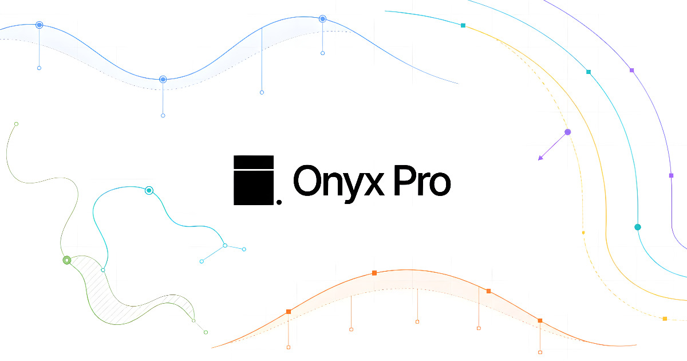

<h1 align="center">Onyx Pro</h1>

<p align="center">
  
</p>

Onyx Pro is a local desktop app for Windows and Linux that clears supported trial state for Kiro, Trae, Warp, Antigravity, and Qoder beta, and manages Codex accounts on Windows.

[Website](https://getonyxpro.com) | [Downloads](https://getonyxpro.com/downloads) | [Pricing](https://getonyxpro.com/#pricing) | [Discord](https://discord.gg/chlo)


## What it does

Onyx Pro runs locally on your machine. It clears supported trial-related state in AI coding IDEs so you can re-run onboarding and evaluation flows on the same computer before you buy.

- Qoder beta support is included
- Codex account management is available on Windows
- Windows now uses a single auto-detect installer
- Linux downloads are DEB packages for x64 and ARM64
- The app stays focused on local cleanup and evaluation

## Supported tools

| Tool        | Type            | Platforms          | Notes                             |
|-------------|-----------------|--------------------|-----------------------------------|
| Kiro        | Reset           | Windows, Linux     | Included in the free trial        |
| Trae        | Reset           | Windows, Linux     | Included in the free trial        |
| Warp        | Reset           | Windows, Linux     | Included in the free trial        |
| Antigravity | Reset           | Windows, Linux     | Included in the free trial        |
| Qoder       | Reset beta      | Windows, Linux     | Included in the free trial        |
| Codex       | Account manager | Windows            | Requires a paid license           |

## Downloads

- Windows 10 and 11 use one auto-detect installer
- Linux uses DEB packages for x64 and ARM64
- Download links are issued from the website after verification

## Pricing

| Plan    | Price | Access   |
|---------|-------|----------|
| 7 Days  | $7    | 1 week   |
| 14 Days | $14   | 2 weeks  |
| 30 Days | $28   | 1 month  |
| Lifetime | $40  | Forever  |

## FAQ

<details>
<summary>Is Onyx Pro a crack, keygen, or piracy tool?</summary>

```text
No. Onyx Pro does not unlock paid features, bypass licensing, distribute third-party software, or generate keys. It resets supported local trial-related state on your own machine.
```
</details>

<details>
<summary>Which tools are included right now?</summary>

```text
Kiro, Trae, Warp, Antigravity, and Qoder beta are supported as reset tools. Codex is supported as a local account manager on Windows. Windsurf support was removed after its rebranding to Devin Desktop and the end of free trials.
```
</details>

<details>
<summary>Does Onyx Pro support Mac?</summary>

```text
Not currently. Onyx Pro supports Windows 10 and 11 with a single Windows installer and Linux via DEB package.
```
</details>

<details>
<summary>Is Onyx Pro affiliated with any IDE vendor?</summary>

```text
No. Onyx Pro is an independent utility developed by CCC Suite and is not affiliated with or endorsed by Kiro, Trae, Warp, Antigravity, Qoder, Codex, Devin Desktop, or their owners.
```
</details>

## Support

- Discord: [discord.gg/chlo](https://discord.gg/chlo)
- Email support is available through the website
- Changelogs are posted in Discord and on the site for each release

## Links

- [getonyxpro.com](https://getonyxpro.com)
- [What is Onyx Pro](https://getonyxpro.com/what-is-onyx-pro)
- [Downloads](https://getonyxpro.com/downloads)
- [Pricing](https://getonyxpro.com/#pricing)

## Disclaimer

Independent utility. Not affiliated with or endorsed by Kiro, Trae, Warp, Antigravity, Qoder, Codex, Devin Desktop, or their owners.

Use is your responsibility and may be subject to the terms, licenses, and laws that apply to the software you choose to test.

<div align="center">

Built by **CCC Suite**

<sub>Onyx Pro is closed source. This repository exists for documentation and promotion only.</sub>

</div>
