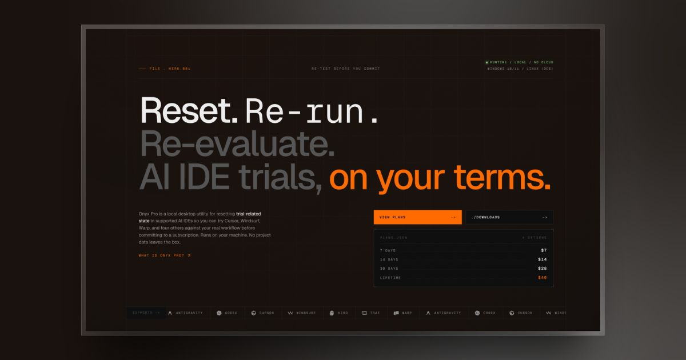
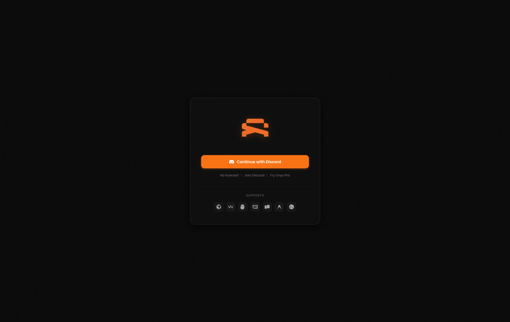
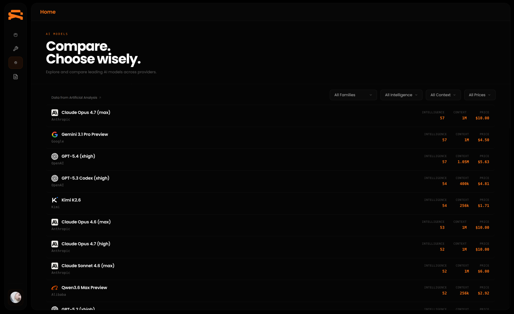

  

# Onyx Pro: AI IDE Trial Reset and Evaluation Utility

**Reset trial-related state in Windsurf, Kiro, Trae, Warp, Antigravity, and Codex so you can properly evaluate each AI IDE against your real workflow before committing to a subscription.**

Onyx Pro is a local desktop app for Windows and Linux. It runs on your machine, clears locally stored trial-related state in supported AI coding IDEs, and lets you run a clean second-pass evaluation on the same device. One-time payment, free trial available, no account required to try.

[Website](https://getonyxpro.com) · [Downloads](https://getonyxpro.com/downloads) · [Pricing](https://getonyxpro.com/#pricing) · [Discord](https://discord.gg/chlo)

 

<!-- REPLACE: hero screenshot of the Onyx Pro dashboard, ideally 1600x900 -->

  

 

## Why AI IDE trials are too short for a real evaluation

Windsurf gives you 14 days. Kiro, Trae, Warp, and Antigravity all run similar windows. Evaluating an AI coding tool against your real stack takes longer than that, especially when you are also shipping work. Most developers either rush the decision or pick the tool with the loudest Twitter presence.

Onyx Pro solves the evaluation problem. Reset the trial state on the IDEs you are testing, re-run onboarding and evaluation flows on the same machine, and compare each AI IDE under real conditions before you pay for a subscription.

This is a tool for informed purchasing decisions. Nothing more.

 

## What Onyx Pro does

Onyx Pro is a local desktop utility. Your code, prompts, and workspace files never leave your machine.

For each supported AI IDE, the app clears locally stored trial-related state and rotates the machine identifiers that the IDE uses for trial tracking. The IDE then treats the machine as a new installation, letting you re-run onboarding and trial flows to complete your evaluation.

Everything the app does is documented openly on the website, in the EULA, and inside the app itself. Use is your responsibility and may be subject to the terms, licenses, and laws that apply to the software you choose to test.

<!-- REPLACE: screenshot of the Tools page with the tool cards visible -->

  

 

## Supported AI IDEs

| Tool          | Type              | Platforms       | Notes                                  |
|---------------|-------------------|-----------------|----------------------------------------|
| Kiro          | Reset             | Windows, Linux  | Included in free trial                 |
| Trae          | Reset             | Windows, Linux  | Included in free trial                 |
| Warp          | Reset             | Windows, Linux  | Included in free trial                 |
| Antigravity   | Reset             | Windows, Linux  | Included in free trial                 |
| Windsurf      | Reset (paid addon)| Windows, Linux  | $5 addon, requires license             |
| Codex         | Account manager   | Windows only    | Not a reset tool, requires license     |

 

## Free trial: try Onyx Pro without paying

You do not need to pay to try Onyx Pro.

- 2 resets each for Kiro, Trae, Warp, and Antigravity
- No account, no Discord, no email, no credit card
- Open the app, click **Try Onyx Pro**, start testing

Trial usage resets weekly based on community activity. If you run out, check back in a few days.

<!-- REPLACE: screenshot of the login screen with the "Try Onyx Pro" option -->

  

 

## Pricing: one-time payment, no subscription

One-time payments only. No subscriptions, no renewals. Every plan gets the same app, the same downloads, and the same support. The only difference is how long you keep access.

| Plan      | Price | Access duration |
|-----------|-------|-----------------|
| 7 Days    | $7    | One week        |
| 14 Days   | $14   | Two weeks       |
| 30 Days   | $28   | One month       |
| Lifetime  | $40   | Forever         |

[See full pricing on getonyxpro.com](https://getonyxpro.com/#pricing)

 

## Features

**Local by design.** The app runs on your machine. Nothing from your development environment is uploaded anywhere.

**Six AI IDEs, one app.** Reset Windsurf, Kiro, Trae, Warp, and Antigravity from a single interface. Manage Codex accounts on Windows.

**AI Models leaderboard.** Browse more than 90 AI models ranked by intelligence score, with data sourced from Artificial Analysis. Filter by provider, context window, price, or intelligence range, and download a system prompt tailored to your stack.

**Clean interface.** Dark glassmorphism, orange accent, Geist Mono for the UI. Built with Electron 39, Vue 3, Pinia, and Vite.

**Transparent behavior.** The website, EULA, and in-app copy describe exactly what a reset changes.

<!-- REPLACE: screenshot of the AI Models leaderboard -->

  

 

## Platforms

- Windows 10 and 11, via NSIS installer. x64, x86, and ARM64.
- Linux, via DEB package. x64 and ARM64.

[Download for your platform](https://getonyxpro.com/downloads)

 

## How to reset an AI IDE trial with Onyx Pro

1. Open Onyx Pro.
2. Pick a supported AI IDE from the Tools page.
3. Click the reset button. The app closes the IDE, clears locally stored trial-related state, and rotates the identifiers the IDE uses for trial tracking.
4. Launch the IDE again and run through your evaluation on a clean slate.

 

## Frequently asked questions

### Is Onyx Pro a crack, keygen, or piracy tool?

No. Onyx Pro does not unlock paid features, bypass licensing, distribute any third-party software, or generate keys. It resets locally stored trial-related state on your own machine so you can re-run onboarding and evaluation flows on supported AI IDEs.

### How does Onyx Pro reset other AI IDEs?

When you click reset for a supported IDE, Onyx Pro closes the IDE process, clears the locally stored trial-related state on your machine, and rotates the machine identifiers the IDE uses for trial tracking. The IDE then treats your machine as a new installation.

### Does Onyx Pro upload my code or prompts anywhere?

No. The app runs locally. Your code, prompts, and workspace files stay on your machine. There is no cloud processing of your development environment.

### Which AI IDEs does Onyx Pro support?

Windsurf, Kiro, Trae, Warp, and Antigravity are supported as reset tools. Codex is supported as a local account manager on Windows. More may be added as new AI IDEs reach the market.

### Do I need a subscription to use Onyx Pro?

No. Every plan is a one-time payment. Lifetime access is $40.

### Which AI IDEs are included in the free trial?

Kiro, Trae, Warp, and Antigravity are included. You get 2 free resets for each of them, with no account, email, or credit card required. Windsurf and Codex require a paid license.

### Does Onyx Pro work on Mac?

Not currently. Onyx Pro supports Windows 10 and 11 and Linux via DEB package. Mac support is not available at this time.

### What happens when my plan expires?

You keep any resets you already ran. You cannot start new ones until you renew or upgrade to a longer plan.

### Is Onyx Pro affiliated with Windsurf or any other IDE vendor?

No. Onyx Pro is an independent utility developed by XTRA Tweaks LLC and is not affiliated with or endorsed by Windsurf, Kiro, Trae, Warp, Antigravity, or Codex.

 

## Community and support

- Discord: [discord.gg/chlo](https://discord.gg/chlo)
- Email support through the website
- Changelogs are posted in Discord and on the site for every release

 

## Links

- [getonyxpro.com](https://getonyxpro.com)
- [What is Onyx Pro](https://getonyxpro.com/what-is-onyx-pro)
- [Downloads](https://getonyxpro.com/downloads)
- [Pricing](https://getonyxpro.com/#pricing)

 

## Disclaimer

Independent utility. Not affiliated with or endorsed by Windsurf, Kiro, Trae, Warp, Antigravity, or Codex.

Use is your responsibility and may be subject to the terms, licenses, and laws that apply to the software you choose to test.

 

Built by **XTRA Tweaks LLC**

Onyx Pro is closed source. This repository exists for documentation and promotion only.

